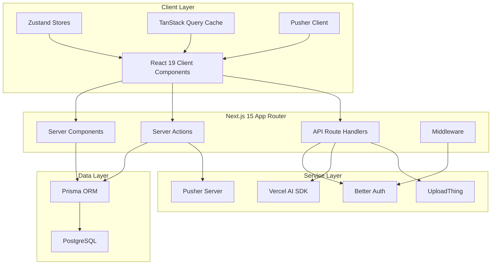

# AI Team Collaboration & Knowledge Hub — Implementation Plan

A production-grade SaaS application for AI-powered team collaboration, knowledge management, and task tracking.

---

## User Review Required

> [!IMPORTANT]
> **Scope & Phased Delivery**: This is a massive application (~200+ files). I propose building it in **4 phases** to ensure quality and allow feedback loops. Each phase produces a fully functional, runnable application.

> [!IMPORTANT]
> **Auth Choice: Better Auth** — Based on research, Better Auth is the modern standard for self-hosted auth in Next.js 15. It includes built-in organization/team management, 2FA, and Prisma adapter support out-of-the-box.

> [!IMPORTANT]
> **Realtime Choice: Pusher** — Pusher is recommended for our use case (comments, notifications, presence). It provides reliable pub/sub messaging without the overhead of Liveblocks' CRDT-based collaboration (which we don't need for this app). If you prefer Liveblocks, let me know.

> [!WARNING]
> **External Services Required** — The app requires accounts for: PostgreSQL (e.g., Neon/Supabase), OpenAI API, UploadThing, Pusher, and optionally Google OAuth credentials. I'll create a `.env.example` with all required variables and a setup guide.

---

## Open Questions

> [!IMPORTANT]
> **Package Manager**: Should I use `pnpm` (recommended for monorepo-friendly, fast installs) or `npm`?

> [!IMPORTANT]
> **Database Provider**: Are you using a hosted PostgreSQL (Neon, Supabase, Railway) or local Docker? This affects the setup guide.

> [!IMPORTANT]
> **Deployment Target**: Vercel (recommended for Next.js) or self-hosted? This affects edge runtime and caching strategy.

---

## Architecture Overview



---

## Phased Delivery Plan

### Phase 1: Foundation & Auth (Core Infrastructure)
- Project scaffolding, configs, design system
- Database schema (complete Prisma schema)
- Authentication (Better Auth + Google OAuth)
- Layout shell, navigation, theme switching
- Middleware, error boundaries, loading states

### Phase 2: Workspaces & Task Management
- Workspace CRUD, member management, roles
- Task management with Kanban board
- Drag-and-drop, filters, search
- Activity logging

### Phase 3: AI Knowledge Assistant & File Upload
- UploadThing document upload
- AI chat with Vercel AI SDK
- Document summarization
- Task generation from notes

### Phase 4: Realtime, Dashboard & Polish
- Pusher realtime comments & notifications
- Presence indicators
- Analytics dashboard with charts
- Command palette, keyboard shortcuts
- E2E tests, CI/CD

---

## Folder Structure

```
nexora/
├── .github/
│   └── workflows/
│       └── ci.yml                    # CI/CD pipeline
├── .husky/
│   ├── pre-commit                    # Lint & format
│   └── commit-msg                    # Commitlint
├── prisma/
│   ├── schema.prisma                 # Complete database schema
│   ├── seed.ts                       # Seed data
│   └── migrations/                   # Auto-generated
├── public/
│   ├── icons/
│   └── images/
├── src/
│   ├── app/
│   │   ├── (auth)/                   # Route group: auth pages
│   │   │   ├── sign-in/
│   │   │   │   └── page.tsx
│   │   │   ├── sign-up/
│   │   │   │   └── page.tsx
│   │   │   └── layout.tsx
│   │   ├── (dashboard)/              # Route group: authenticated app
│   │   │   ├── [workspaceId]/
│   │   │   │   ├── layout.tsx
│   │   │   │   ├── page.tsx          # Workspace dashboard
│   │   │   │   ├── tasks/
│   │   │   │   │   ├── page.tsx      # Kanban board
│   │   │   │   │   ├── loading.tsx
│   │   │   │   │   └── @modal/
│   │   │   │   │       └── (..)tasks/[taskId]/
│   │   │   │   │           └── page.tsx  # Intercepting route modal
│   │   │   │   ├── knowledge/
│   │   │   │   │   ├── page.tsx
│   │   │   │   │   ├── [conversationId]/
│   │   │   │   │   │   └── page.tsx  # AI chat view
│   │   │   │   │   └── loading.tsx
│   │   │   │   ├── settings/
│   │   │   │   │   ├── page.tsx
│   │   │   │   │   ├── members/
│   │   │   │   │   │   └── page.tsx
│   │   │   │   │   └── layout.tsx
│   │   │   │   └── analytics/
│   │   │   │       └── page.tsx
│   │   │   ├── layout.tsx            # Dashboard shell
│   │   │   ├── loading.tsx
│   │   │   ├── error.tsx
│   │   │   └── page.tsx              # Workspace selector
│   │   ├── api/
│   │   │   ├── auth/[...all]/
│   │   │   │   └── route.ts          # Better Auth handler
│   │   │   ├── chat/
│   │   │   │   └── route.ts          # AI chat streaming
│   │   │   ├── uploadthing/
│   │   │   │   ├── core.ts
│   │   │   │   └── route.ts
│   │   │   └── pusher/
│   │   │       └── auth/
│   │   │           └── route.ts      # Pusher auth
│   │   ├── layout.tsx                # Root layout
│   │   ├── page.tsx                  # Landing page
│   │   ├── loading.tsx
│   │   ├── error.tsx
│   │   ├── not-found.tsx
│   │   └── globals.css
│   ├── components/
│   │   ├── ui/                       # shadcn/ui components
│   │   ├── layout/
│   │   │   ├── sidebar.tsx
│   │   │   ├── header.tsx
│   │   │   ├── mobile-nav.tsx
│   │   │   └── user-menu.tsx
│   │   ├── auth/
│   │   │   ├── sign-in-form.tsx
│   │   │   ├── sign-up-form.tsx
│   │   │   └── social-auth-button.tsx
│   │   ├── workspace/
│   │   │   ├── create-workspace-dialog.tsx
│   │   │   ├── workspace-switcher.tsx
│   │   │   ├── member-list.tsx
│   │   │   └── invite-member-dialog.tsx
│   │   ├── tasks/
│   │   │   ├── kanban-board.tsx
│   │   │   ├── kanban-column.tsx
│   │   │   ├── task-card.tsx
│   │   │   ├── create-task-dialog.tsx
│   │   │   ├── task-detail-panel.tsx
│   │   │   └── task-filters.tsx
│   │   ├── knowledge/
│   │   │   ├── chat-interface.tsx
│   │   │   ├── chat-message.tsx
│   │   │   ├── document-upload.tsx
│   │   │   ├── document-list.tsx
│   │   │   └── ai-summary-card.tsx
│   │   ├── realtime/
│   │   │   ├── comment-section.tsx
│   │   │   ├── notification-bell.tsx
│   │   │   ├── notification-list.tsx
│   │   │   └── presence-indicator.tsx
│   │   ├── dashboard/
│   │   │   ├── stats-cards.tsx
│   │   │   ├── productivity-chart.tsx
│   │   │   ├── activity-feed.tsx
│   │   │   └── ai-insights-card.tsx
│   │   └── shared/
│   │       ├── command-palette.tsx
│   │       ├── error-boundary.tsx
│   │       ├── empty-state.tsx
│   │       ├── loading-skeleton.tsx
│   │       ├── confirm-dialog.tsx
│   │       └── page-header.tsx
│   ├── hooks/
│   │   ├── use-auth.ts
│   │   ├── use-workspace.ts
│   │   ├── use-tasks.ts
│   │   ├── use-realtime.ts
│   │   ├── use-debounce.ts
│   │   ├── use-keyboard-shortcut.ts
│   │   ├── use-media-query.ts
│   │   └── use-optimistic-action.ts
│   ├── lib/
│   │   ├── auth.ts                   # Better Auth server config
│   │   ├── auth-client.ts            # Better Auth client
│   │   ├── db.ts                     # Prisma client singleton
│   │   ├── pusher-server.ts          # Pusher server instance
│   │   ├── pusher-client.ts          # Pusher client instance
│   │   ├── uploadthing.ts            # UploadThing utilities
│   │   ├── ai.ts                     # AI SDK configuration
│   │   ├── utils.ts                  # General utilities (cn, etc.)
│   │   └── constants.ts              # App constants
│   ├── actions/
│   │   ├── workspace.actions.ts      # Server actions for workspaces
│   │   ├── task.actions.ts           # Server actions for tasks
│   │   ├── knowledge.actions.ts      # Server actions for AI/docs
│   │   ├── comment.actions.ts        # Server actions for comments
│   │   └── notification.actions.ts   # Server actions for notifications
│   ├── stores/
│   │   ├── ui-store.ts               # Sidebar, modals, theme
│   │   ├── workspace-store.ts        # Active workspace state
│   │   └── notification-store.ts     # Notification state
│   ├── validators/
│   │   ├── auth.schema.ts
│   │   ├── workspace.schema.ts
│   │   ├── task.schema.ts
│   │   └── common.schema.ts
│   ├── types/
│   │   ├── index.ts
│   │   ├── workspace.ts
│   │   ├── task.ts
│   │   └── ai.ts
│   ├── config/
│   │   ├── site.ts                   # Site metadata
│   │   ├── navigation.ts             # Nav items config
│   │   └── keyboard-shortcuts.ts     # Shortcut definitions
│   └── middleware.ts                 # Auth + workspace middleware
├── tests/
│   ├── unit/
│   │   └── ...                       # Vitest unit tests
│   ├── e2e/
│   │   └── ...                       # Playwright tests
│   └── setup.ts
├── .env.example
├── .eslintrc.json
├── .prettierrc
├── .commitlintrc.json
├── tailwind.config.ts
├── tsconfig.json
├── next.config.ts
├── vitest.config.ts
├── playwright.config.ts
├── components.json                   # shadcn/ui config
├── package.json
└── README.md
```

---

## Proposed Changes

### Phase 1: Foundation & Authentication

---

#### Project Setup & Configuration

##### [NEW] package.json
All dependencies: next@15, react@19, typescript, tailwindcss, @shadcn/ui, prisma, @prisma/client, better-auth, @better-auth/prisma-adapter, zustand, @tanstack/react-query, zod, framer-motion, ai, @ai-sdk/openai, @ai-sdk/react, uploadthing, @uploadthing/react, pusher, pusher-js, recharts, @dnd-kit/core, @dnd-kit/sortable, vitest, @playwright/test, eslint, prettier, husky, @commitlint/cli, @commitlint/config-conventional, cmdk (command palette)

##### [NEW] next.config.ts
- Enable Turbopack for dev
- Configure image domains
- Enable experimental features (ppr, typedRoutes)
- Server external packages for Prisma

##### [NEW] tsconfig.json
- Strict mode enabled
- Absolute imports with `@/` alias
- Path mappings for all directories

##### [NEW] tailwind.config.ts
- Custom color palette (dark mode support via CSS variables)
- Custom fonts (Inter + JetBrains Mono)
- Animation keyframes for micro-animations
- shadcn/ui integration

##### [NEW] .eslintrc.json
- Next.js recommended + strict TypeScript rules
- Import ordering rules
- React hooks rules

##### [NEW] .prettierrc
- Semi, single quote, trailing comma, tab width 2

##### [NEW] .commitlintrc.json
- Conventional commits config

##### [NEW] .husky/pre-commit & .husky/commit-msg
- Run lint-staged on pre-commit
- Run commitlint on commit-msg

##### [NEW] vitest.config.ts
- Path aliases, jsdom environment, coverage

##### [NEW] playwright.config.ts
- Base URL, test directory, webServer config

##### [NEW] .github/workflows/ci.yml
- Lint, type-check, unit test, build, e2e test

##### [NEW] .env.example
- All environment variables documented

---

#### Database Schema

##### [NEW] prisma/schema.prisma
Complete schema covering all entities:

```prisma
generator client {
  provider = "prisma-client-js"
}

datasource db {
  provider = "postgresql"
  url      = env("DATABASE_URL")
}

// ============ Auth (Better Auth managed) ============

model User {
  id            String    @id @default(cuid())
  name          String
  email         String    @unique
  emailVerified Boolean   @default(false)
  image         String?
  createdAt     DateTime  @default(now())
  updatedAt     DateTime  @updatedAt

  sessions      Session[]
  accounts      Account[]
  members       Member[]
  tasks         Task[]          @relation("assignee")
  createdTasks  Task[]          @relation("creator")
  comments      Comment[]
  notifications Notification[]
  activityLogs  ActivityLog[]
  aiConversations AIConversation[]
  uploadedDocuments Document[]

  @@map("users")
}

model Session {
  id        String   @id @default(cuid())
  expiresAt DateTime
  token     String   @unique
  createdAt DateTime @default(now())
  updatedAt DateTime @updatedAt
  ipAddress String?
  userAgent String?
  userId    String
  user      User     @relation(fields: [userId], references: [id], onDelete: Cascade)

  @@map("sessions")
}

model Account {
  id                String   @id @default(cuid())
  accountId         String
  providerId        String
  userId            String
  user              User     @relation(fields: [userId], references: [id], onDelete: Cascade)
  accessToken       String?
  refreshToken      String?
  idToken           String?
  accessTokenExpiresAt DateTime?
  refreshTokenExpiresAt DateTime?
  scope             String?
  password          String?
  createdAt         DateTime @default(now())
  updatedAt         DateTime @updatedAt

  @@map("accounts")
}

model Verification {
  id         String   @id @default(cuid())
  identifier String
  value      String
  expiresAt  DateTime
  createdAt  DateTime @default(now())
  updatedAt  DateTime @updatedAt

  @@map("verifications")
}

// ============ Organization / Workspace ============

model Organization {
  id          String   @id @default(cuid())
  name        String
  slug        String   @unique
  logo        String?
  createdAt   DateTime @default(now())
  updatedAt   DateTime @updatedAt
  metadata    String?

  members     Member[]
  workspaces  Workspace[]
  invitations Invitation[]

  @@map("organizations")
}

model Member {
  id             String   @id @default(cuid())
  organizationId String
  userId         String
  role           MemberRole @default(MEMBER)
  createdAt      DateTime   @default(now())

  organization   Organization @relation(fields: [organizationId], references: [id], onDelete: Cascade)
  user           User         @relation(fields: [userId], references: [id], onDelete: Cascade)

  @@unique([organizationId, userId])
  @@map("members")
}

enum MemberRole {
  OWNER
  ADMIN
  MEMBER
}

model Invitation {
  id             String           @id @default(cuid())
  organizationId String
  email          String
  role           MemberRole       @default(MEMBER)
  status         InvitationStatus @default(PENDING)
  expiresAt      DateTime
  inviterId      String
  createdAt      DateTime         @default(now())

  organization   Organization @relation(fields: [organizationId], references: [id], onDelete: Cascade)

  @@map("invitations")
}

enum InvitationStatus {
  PENDING
  ACCEPTED
  EXPIRED
}

model Workspace {
  id             String   @id @default(cuid())
  name           String
  description    String?
  color          String   @default("#6366f1")
  organizationId String
  createdAt      DateTime @default(now())
  updatedAt      DateTime @updatedAt

  organization   Organization @relation(fields: [organizationId], references: [id], onDelete: Cascade)
  tasks          Task[]
  documents      Document[]
  aiConversations AIConversation[]
  activityLogs   ActivityLog[]

  @@map("workspaces")
}

// ============ Tasks ============

model Task {
  id          String     @id @default(cuid())
  title       String
  description String?
  status      TaskStatus @default(TODO)
  priority    TaskPriority @default(MEDIUM)
  position    Int        @default(0)
  dueDate     DateTime?
  workspaceId String
  assigneeId  String?
  creatorId   String
  createdAt   DateTime   @default(now())
  updatedAt   DateTime   @updatedAt

  workspace   Workspace  @relation(fields: [workspaceId], references: [id], onDelete: Cascade)
  assignee    User?      @relation("assignee", fields: [assigneeId], references: [id])
  creator     User       @relation("creator", fields: [creatorId], references: [id])
  comments    Comment[]
  tags        TagsOnTasks[]
  activityLogs ActivityLog[]

  @@index([workspaceId, status])
  @@index([assigneeId])
  @@map("tasks")
}

enum TaskStatus {
  TODO
  IN_PROGRESS
  IN_REVIEW
  DONE
}

enum TaskPriority {
  LOW
  MEDIUM
  HIGH
  URGENT
}

model Tag {
  id    String @id @default(cuid())
  name  String
  color String @default("#6366f1")
  tasks TagsOnTasks[]

  @@map("tags")
}

model TagsOnTasks {
  taskId String
  tagId  String
  task   Task @relation(fields: [taskId], references: [id], onDelete: Cascade)
  tag    Tag  @relation(fields: [tagId], references: [id], onDelete: Cascade)

  @@id([taskId, tagId])
  @@map("tags_on_tasks")
}

// ============ Comments ============

model Comment {
  id        String   @id @default(cuid())
  content   String
  taskId    String
  authorId  String
  createdAt DateTime @default(now())
  updatedAt DateTime @updatedAt

  task      Task @relation(fields: [taskId], references: [id], onDelete: Cascade)
  author    User @relation(fields: [authorId], references: [id])

  @@index([taskId])
  @@map("comments")
}

// ============ Notifications ============

model Notification {
  id        String           @id @default(cuid())
  type      NotificationType
  title     String
  body      String?
  read      Boolean          @default(false)
  userId    String
  linkUrl   String?
  createdAt DateTime         @default(now())

  user      User @relation(fields: [userId], references: [id], onDelete: Cascade)

  @@index([userId, read])
  @@map("notifications")
}

enum NotificationType {
  TASK_ASSIGNED
  TASK_UPDATED
  COMMENT_ADDED
  MENTION
  INVITATION
  AI_COMPLETE
}

// ============ AI & Documents ============

model Document {
  id          String   @id @default(cuid())
  name        String
  url         String
  fileKey     String
  fileType    String
  fileSize    Int
  workspaceId String
  uploaderId  String
  createdAt   DateTime @default(now())

  workspace   Workspace @relation(fields: [workspaceId], references: [id], onDelete: Cascade)
  uploader    User      @relation(fields: [uploaderId], references: [id])
  aiConversations AIConversation[]

  @@index([workspaceId])
  @@map("documents")
}

model AIConversation {
  id          String   @id @default(cuid())
  title       String?
  workspaceId String
  userId      String
  documentId  String?
  createdAt   DateTime @default(now())
  updatedAt   DateTime @updatedAt

  workspace   Workspace @relation(fields: [workspaceId], references: [id], onDelete: Cascade)
  user        User      @relation(fields: [userId], references: [id])
  document    Document? @relation(fields: [documentId], references: [id])
  messages    AIMessage[]

  @@index([workspaceId, userId])
  @@map("ai_conversations")
}

model AIMessage {
  id             String   @id @default(cuid())
  role           AIRole
  content        String
  conversationId String
  createdAt      DateTime @default(now())

  conversation   AIConversation @relation(fields: [conversationId], references: [id], onDelete: Cascade)

  @@map("ai_messages")
}

enum AIRole {
  USER
  ASSISTANT
  SYSTEM
}

// ============ Activity Logs ============

model ActivityLog {
  id          String       @id @default(cuid())
  action      ActivityAction
  entityType  String
  entityId    String
  metadata    Json?
  userId      String
  workspaceId String
  createdAt   DateTime     @default(now())

  user        User      @relation(fields: [userId], references: [id])
  workspace   Workspace @relation(fields: [workspaceId], references: [id], onDelete: Cascade)
  task        Task?     @relation(fields: [entityId], references: [id], onDelete: SetNull)

  @@index([workspaceId, createdAt])
  @@map("activity_logs")
}

enum ActivityAction {
  CREATED
  UPDATED
  DELETED
  COMMENTED
  ASSIGNED
  STATUS_CHANGED
  UPLOADED
  AI_QUERY
}
```

##### [NEW] prisma/seed.ts
- Seed demo organization, workspace, users, and sample tasks

##### [NEW] src/lib/db.ts
- Prisma client singleton pattern (prevent hot-reload duplication)

---

#### Authentication (Better Auth)

##### [NEW] src/lib/auth.ts
- Better Auth server configuration
- Prisma adapter with PostgreSQL
- Organization plugin enabled
- Email/password + Google OAuth providers
- Session configuration
- RBAC setup

##### [NEW] src/lib/auth-client.ts
- Client-side auth instance
- Organization client plugin
- Exported hooks: `useSession`, `signIn`, `signOut`, `signUp`

##### [NEW] src/app/api/auth/[...all]/route.ts
- Better Auth catch-all route handler

##### [NEW] src/middleware.ts
- Auth session validation
- Redirect unauthenticated users to sign-in
- Workspace ID validation
- Public routes whitelist

##### [NEW] src/app/(auth)/layout.tsx
- Auth pages layout (centered, branded)

##### [NEW] src/app/(auth)/sign-in/page.tsx
- Sign-in page with email/password form + Google OAuth

##### [NEW] src/app/(auth)/sign-up/page.tsx
- Sign-up page with email/password + name

##### [NEW] src/components/auth/sign-in-form.tsx
- Client component with Zod validation
- Email + password fields
- Error handling, loading states

##### [NEW] src/components/auth/sign-up-form.tsx
- Client component with Zod validation

##### [NEW] src/components/auth/social-auth-button.tsx
- Google OAuth button component

---

#### Core Layout & Design System

##### [NEW] src/app/globals.css
- CSS variables for light/dark themes
- Custom color palette (indigo/violet primary, slate neutrals)
- shadcn/ui CSS variable integration
- Custom scrollbar styles
- Animation utilities

##### [NEW] src/app/layout.tsx
- Root layout with providers
- Font loading (Inter + JetBrains Mono via `next/font`)
- Theme provider, query provider, auth provider
- Metadata configuration
- UploadThing SSR plugin

##### [NEW] src/app/page.tsx
- Beautiful landing page with hero, features, CTA
- Animated with Framer Motion

##### [NEW] src/app/(dashboard)/layout.tsx
- Dashboard shell with sidebar, header
- Workspace context provider
- Realtime connection setup

##### [NEW] src/components/layout/sidebar.tsx
- Collapsible sidebar with workspace switcher
- Navigation links with active state
- Animated transitions

##### [NEW] src/components/layout/header.tsx
- Top header with breadcrumbs
- Search trigger, notification bell, user menu

##### [NEW] src/components/layout/user-menu.tsx
- Avatar dropdown with profile, settings, sign-out

##### [NEW] src/components/layout/mobile-nav.tsx
- Responsive mobile navigation

##### [NEW] src/components/shared/command-palette.tsx
- Global command palette (cmdk) with keyboard shortcut ⌘K
- Search across tasks, workspaces, navigate pages

##### [NEW] src/components/shared/error-boundary.tsx
- React error boundary with fallback UI

##### [NEW] src/components/shared/loading-skeleton.tsx
- Reusable skeleton loaders

##### [NEW] src/components/shared/empty-state.tsx
- Empty state component with illustration and CTA

##### [NEW] src/components/shared/page-header.tsx
- Page header with title, description, actions

---

#### Providers & Stores

##### [NEW] src/app/providers.tsx
- Combined providers: QueryClientProvider, ThemeProvider, etc.

##### [NEW] src/stores/ui-store.ts
- Zustand store: sidebar collapsed, active modal, command palette open

##### [NEW] src/stores/workspace-store.ts
- Zustand store: active workspace, active organization

##### [NEW] src/stores/notification-store.ts
- Zustand store: unread count, notifications list

---

#### Utilities & Config

##### [NEW] src/lib/utils.ts
- `cn()` classname merger, date formatters, etc.

##### [NEW] src/lib/constants.ts
- App-wide constants

##### [NEW] src/config/site.ts
- Site metadata, name, description

##### [NEW] src/config/navigation.ts
- Navigation items configuration

##### [NEW] src/config/keyboard-shortcuts.ts
- Keyboard shortcut definitions

##### [NEW] src/validators/auth.schema.ts
- Zod schemas for sign-in, sign-up

##### [NEW] src/validators/common.schema.ts
- Shared Zod schemas (pagination, etc.)

##### [NEW] src/types/index.ts
- Shared TypeScript types

---

### Phase 2: Workspaces & Task Management

---

#### Workspace Management

##### [NEW] src/actions/workspace.actions.ts
- `createWorkspace` — Create workspace within org
- `updateWorkspace` — Update workspace settings
- `deleteWorkspace` — Delete workspace (owner/admin only)
- `inviteMember` — Send invitation email
- `removeMember` — Remove member from org
- `updateMemberRole` — Change member role

##### [NEW] src/components/workspace/create-workspace-dialog.tsx
- Modal for creating new workspace

##### [NEW] src/components/workspace/workspace-switcher.tsx
- Dropdown to switch between workspaces

##### [NEW] src/components/workspace/member-list.tsx
- List of organization members with role badges

##### [NEW] src/components/workspace/invite-member-dialog.tsx
- Modal for inviting new members

##### [NEW] src/app/(dashboard)/page.tsx
- Workspace selector page

##### [NEW] src/app/(dashboard)/[workspaceId]/page.tsx
- Workspace dashboard overview

##### [NEW] src/app/(dashboard)/[workspaceId]/settings/page.tsx
- Workspace settings page

##### [NEW] src/app/(dashboard)/[workspaceId]/settings/members/page.tsx
- Members management page

##### [NEW] src/validators/workspace.schema.ts
- Zod schemas for workspace operations

##### [NEW] src/hooks/use-workspace.ts
- Workspace-related hooks

---

#### Task Management

##### [NEW] src/actions/task.actions.ts
- `createTask` — Create new task
- `updateTask` — Update task fields
- `deleteTask` — Delete task
- `moveTask` — Update status/position (for drag-and-drop)
- `getTasks` — Get filtered tasks

##### [NEW] src/components/tasks/kanban-board.tsx
- Full Kanban board with columns (TODO, In Progress, In Review, Done)
- Uses @dnd-kit for drag-and-drop

##### [NEW] src/components/tasks/kanban-column.tsx
- Individual Kanban column with drop zone

##### [NEW] src/components/tasks/task-card.tsx
- Task card with priority badge, assignee avatar, due date

##### [NEW] src/components/tasks/create-task-dialog.tsx
- Task creation modal with form

##### [NEW] src/components/tasks/task-detail-panel.tsx
- Full task detail view (used in intercepting route modal)

##### [NEW] src/components/tasks/task-filters.tsx
- Filter bar: status, priority, assignee, search

##### [NEW] src/app/(dashboard)/[workspaceId]/tasks/page.tsx
- Tasks page with Kanban board

##### [NEW] src/app/(dashboard)/[workspaceId]/tasks/@modal/(..)tasks/[taskId]/page.tsx
- Intercepting route for task detail modal

##### [NEW] src/validators/task.schema.ts
- Zod schemas for task operations

##### [NEW] src/hooks/use-tasks.ts
- Task-related hooks with TanStack Query

---

### Phase 3: AI Knowledge Assistant & Documents

---

#### Document Upload

##### [NEW] src/app/api/uploadthing/core.ts
- UploadThing file router with PDF/document endpoints
- Auth middleware

##### [NEW] src/app/api/uploadthing/route.ts
- UploadThing route handler

##### [NEW] src/lib/uploadthing.ts
- Generated upload components

##### [NEW] src/components/knowledge/document-upload.tsx
- Document upload dropzone component

##### [NEW] src/components/knowledge/document-list.tsx
- List of uploaded documents with actions

##### [NEW] src/actions/knowledge.actions.ts
- `saveDocument` — Save document metadata
- `deleteDocument` — Remove document
- `summarizeDocument` — AI summarization
- `generateTasks` — Generate tasks from notes

---

#### AI Chat

##### [NEW] src/app/api/chat/route.ts
- Vercel AI SDK streaming chat endpoint
- OpenAI integration with system prompts
- Document context injection

##### [NEW] src/lib/ai.ts
- AI SDK configuration and helpers

##### [NEW] src/components/knowledge/chat-interface.tsx
- Full chat UI with message list, input, streaming
- Uses `useChat` from `@ai-sdk/react`

##### [NEW] src/components/knowledge/chat-message.tsx
- Individual message bubble (user/assistant)
- Markdown rendering for AI responses

##### [NEW] src/components/knowledge/ai-summary-card.tsx
- Card displaying AI-generated summaries

##### [NEW] src/app/(dashboard)/[workspaceId]/knowledge/page.tsx
- Knowledge hub main page (conversations list + document list)

##### [NEW] src/app/(dashboard)/[workspaceId]/knowledge/[conversationId]/page.tsx
- Individual AI conversation view

##### [NEW] src/types/ai.ts
- AI-related TypeScript types

---

### Phase 4: Realtime, Dashboard & Polish

---

#### Realtime (Pusher)

##### [NEW] src/lib/pusher-server.ts
- Pusher server instance

##### [NEW] src/lib/pusher-client.ts
- Pusher client instance

##### [NEW] src/app/api/pusher/auth/route.ts
- Pusher authentication endpoint

##### [NEW] src/hooks/use-realtime.ts
- Custom hook for Pusher subscriptions

##### [NEW] src/components/realtime/comment-section.tsx
- Realtime comment section on tasks

##### [NEW] src/components/realtime/notification-bell.tsx
- Notification bell with unread count

##### [NEW] src/components/realtime/notification-list.tsx
- Notification dropdown/panel

##### [NEW] src/components/realtime/presence-indicator.tsx
- Online/offline presence dot

##### [NEW] src/actions/comment.actions.ts
- `createComment` — Add comment + trigger Pusher event
- `getComments` — Fetch comments for task

##### [NEW] src/actions/notification.actions.ts
- `markAsRead` — Mark notification read
- `markAllAsRead` — Mark all notifications read
- `getNotifications` — Fetch user notifications

---

#### Dashboard & Analytics

##### [NEW] src/components/dashboard/stats-cards.tsx
- Overview stats: total tasks, completed, overdue, members

##### [NEW] src/components/dashboard/productivity-chart.tsx
- Recharts area/bar chart showing task completion over time

##### [NEW] src/components/dashboard/activity-feed.tsx
- Recent activity log feed

##### [NEW] src/components/dashboard/ai-insights-card.tsx
- AI-generated team productivity insights

##### [NEW] src/app/(dashboard)/[workspaceId]/analytics/page.tsx
- Full analytics page with charts and insights

---

#### Polish & Testing

##### [NEW] tests/unit/validators.test.ts
- Unit tests for Zod schemas

##### [NEW] tests/unit/utils.test.ts
- Unit tests for utility functions

##### [NEW] tests/e2e/auth.spec.ts
- E2E tests for authentication flow

##### [NEW] tests/e2e/tasks.spec.ts
- E2E tests for task management

##### [NEW] README.md
- Complete setup instructions
- Architecture documentation
- Environment variable guide
- Development workflow guide

---

## Verification Plan

### Automated Tests
```bash
# Type checking
npx tsc --noEmit

# Linting
npx eslint src/ --ext .ts,.tsx

# Unit tests
npx vitest run

# Build verification
npm run build

# E2E tests (requires running dev server)
npx playwright test
```

### Manual Verification
- Verify auth flow: sign-up → sign-in → protected routes
- Verify workspace creation and member management
- Verify Kanban drag-and-drop functionality
- Verify AI chat streaming
- Verify realtime comment delivery
- Verify dark/light theme toggle
- Verify responsive design on mobile viewport
- Verify command palette navigation

---

## Key Design Decisions

1. **Better Auth over Auth.js** — Modern, TypeScript-first, built-in org management, actively maintained with official recommendation.

2. **Pusher over Liveblocks** — Our realtime needs (comments, notifications, presence) are pub/sub patterns, not collaborative editing. Pusher is simpler and more cost-effective.

3. **Feature-based component structure** — Components grouped by feature (`tasks/`, `knowledge/`, `realtime/`) rather than by type (`buttons/`, `modals/`). Scales better with team growth.

4. **Server Actions over API routes** — For mutations (create/update/delete), server actions provide better DX with automatic revalidation. API routes reserved for streaming (AI chat), webhooks (UploadThing, Pusher auth), and Better Auth.

5. **Shared table multi-tenancy** — All workspace data scoped by `workspaceId`/`organizationId` foreign keys with indexes. Simpler than schema-per-tenant and sufficient for this use case.

6. **Intercepting routes for modals** — Task detail opens as a modal overlay when navigating from the Kanban board, but as a full page when accessed directly via URL. Native Next.js pattern.
